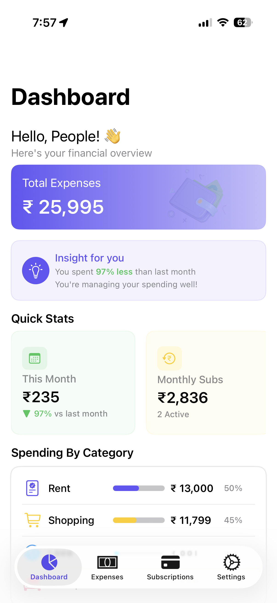
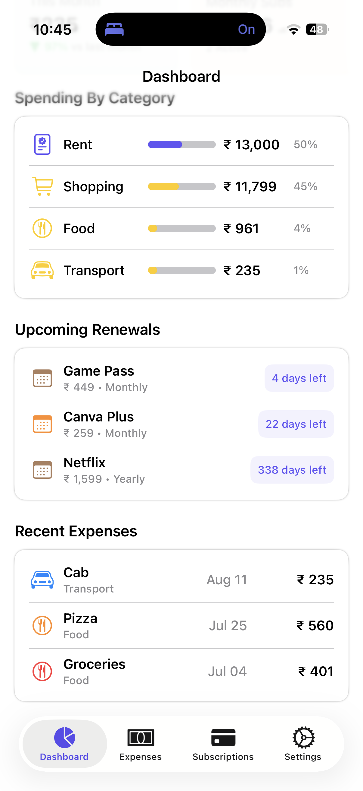
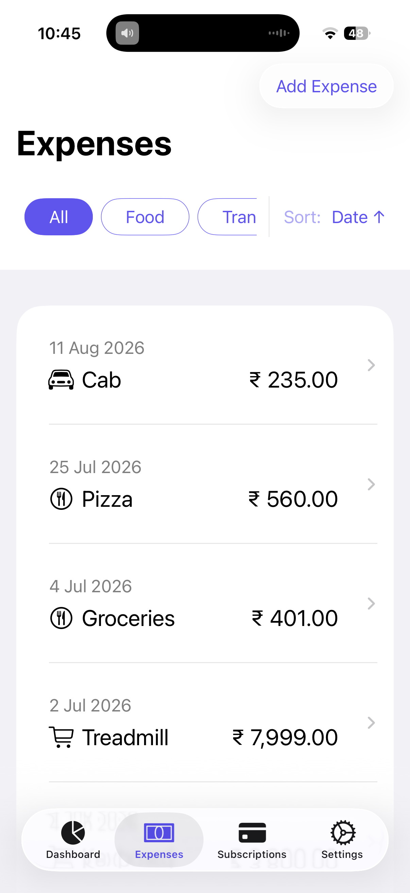
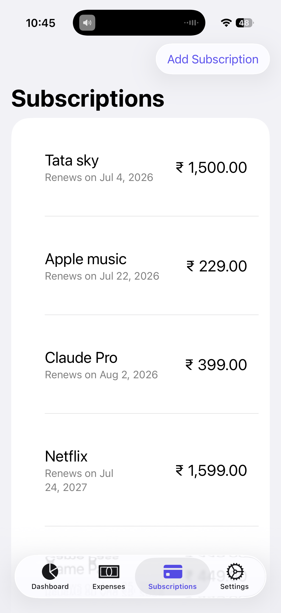

<p align="center">
  
</p>

<h1 align="center">FinTrack</h1>

<p align="center">
  A personal finance tracking application built with SwiftUI to manage expenses, subscriptions, and financial insights through clean architecture and reusable components.
</p>

---

## 📱 Preview

<p align="center">
   
   &nbsp;&nbsp;
   
   &nbsp;&nbsp;
   
   &nbsp;&nbsp;
   
</p>

---

## 📖 Project Overview

FinTrack is a personal finance tracking application built to help users manage expenses and subscriptions while gaining meaningful insights into their spending habits.

The project was started to deepen my SwiftUI expertise by building an application using production-oriented development practices rather than isolated examples or tutorials. The focus extends beyond implementing features to designing clean architecture, reusable components, maintainable code, and a consistent user experience.

FinTrack continues to evolve incrementally, serving as a platform to apply new concepts, refine engineering decisions, and expand functionality while maintaining a strong emphasis on architecture, code quality, and long-term maintainability.

---

## ✨ Features

### 💸 Expense Management

- Track daily expenses across predefined categories
- Create, edit, and delete expense records
- Sort and filter expenses for easier navigation

### 🔄 Subscription Management

- Track recurring monthly and yearly subscriptions
- View upcoming renewal dates
- Create, edit, and delete subscriptions

### 📊 Dashboard & Insights

- Consolidated dashboard with monthly insights and quick statistics
- Spending breakdown by category
- Upcoming renewals summary
- Recent expenses overview
---

## 🛠️ Tech Stack

| Category           | Technology               |
|--------------------|--------------------------|
| Language           | Swift                    |
| UI                 | SwiftUI                  |
| Architecture       | MVVM                     |
| State Management   | Combine                  |
| Persistence        | JSON-based Local Storage |
| IDE                | Xcode                    |
| Version Control    | Git & GitHub             |
---

## 🏛️ Architecture

FinTrack follows the **MVVM (Model–View–ViewModel)** architecture, with a **Single Source of Truth** approach to keep the application modular and maintainable as new features are introduced.

### Data Flow

```text
SwiftUI Views
  │
  ▼
ViewModels
  │
  ▼
Stores
  │
  ▼
Persistence
  │
  ▼
Local JSON
```

Stores act as the Single Source of Truth, while ViewModels handle business logic and data transformations required by the Views. Persistence is abstracted behind protocols so the storage implementation can evolve independently.

### Architectural Decisions

- Follow MVVM to separate presentation from business logic.
- Maintain a Single Source of Truth using dedicated Stores.
- Abstract persistence behind protocols to keep storage implementation independent.
- Derive dashboard state through ViewModels instead of duplicating data.
- Build reusable UI components using a shared Design System.
- Organize the project around feature boundaries with shared Core and Design System components.
---

## 📂 Project Structure

```text
FinTrack
│
├── Core
│   └── Stores
│
├── DesignSystem
│   ├── Components
│   ├── AppColors
│   ├── AppTypography
│   ├── AppSpacing
│   ├── AppCornerRadius
│   └── AppShadowRadius
│
├── Features
│   ├── Dashboard
│   ├── Expenses
│   ├── Subscriptions
│   └── Settings
│
├── Helpers & Extensions
│
└── Assets.xcassets
```
---

## 🔀 Development Workflow

Each feature is developed on its own `feature/<name>` branch, created from `development`:

1. Implement the feature with small, milestone-scoped commits
2. Push the branch and open a pull request into `development`
3. Self-review the diff and merge using a merge commit, preserving the feature branch's commit history
4. Pull the latest `development` and create the next feature branch

`development` serves as the integration branch where features are combined and tested, while `main` is updated periodically with stable project milestones. Documentation changes follow the same workflow and are developed separately, such as the `documentation/v1` branch used for the first project phase.

---

## 🚀 Getting Started

Clone the repository and open the project in Xcode.

```bash
git clone https://github.com/anjantewani/FinTrack.git
cd FinTrack
open FinTrack.xcodeproj
```

Build and run the project using an iOS Simulator or a connected iOS device.

---

## 🗺️ Roadmap

### Phase 2
- [ ] Automatic subscription renewal processing
- [ ] Automatic expense generation for recurring subscriptions
- [ ] Dashboard charts and spending trends
- [ ] Budget planning and spending limits

### Phase 3
- [ ] Local notifications for upcoming renewals
- [ ] Export data (CSV/PDF)
- [ ] Reset application data
- [ ] App settings (appearance and preferences)

### Future Exploration
- [ ] Siri Shortcuts integration
- [ ] Siri queries for expenses and subscription insights